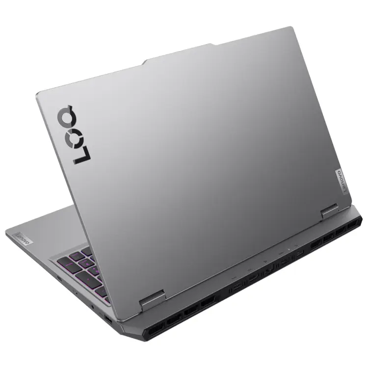
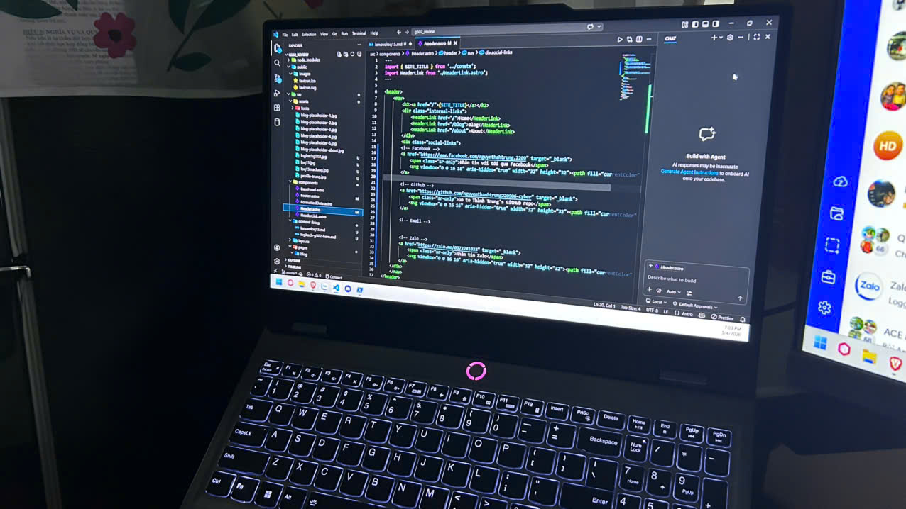
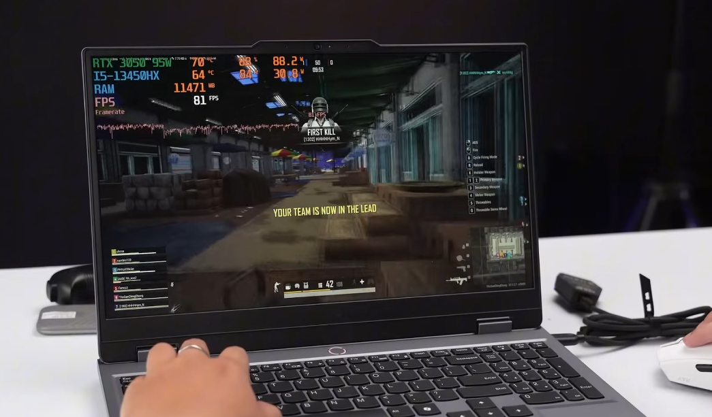

Chào mọi người, mình là Nguyễn Thành Trung. Là một sinh viên IT năm 2 thường xuyên phải xử lý các project Docker nặng nề ban ngày và "try-hard" Elden Ring ban đêm, mình đã dành hơn 6 tháng để thực chiến cùng Lenovo LOQ 15. 

Dưới đây là những đánh giá thực tế nhất về chiếc máy được mệnh danh là "Tiểu Legion" này.

### 1. Thông số kỹ thuật (Technical Specifications)

Để anh em có cái nhìn tổng quan, đây là cấu hình phiên bản mình đang sử dụng để làm bài test này:

| Thành phần | Chi tiết cấu hình |
| :--- | :--- |
| **CPU** | Intel Core i5-13450HX (8 nhân, 12 luồng) |
| **GPU** | NVIDIA GeForce RTX 3050 6GB (TDP 95W + MUX Switch) |
| **RAM** | 16GB DDR5 4800MHz |
| **SSD** | 512GB NVMe PCIe Gen 4 |
| **Màn hình** | 15.6 inch FHD, IPS, 144Hz, 100% sRGB |

---

### 2. Thiết kế: Sự giao thoa giữa Tối giản và Thực dụng

LOQ 15 không mang vẻ ngoài lòe loẹt. Nó thừa hưởng DNA vuông vức từ dòng Legion cao cấp, mang lại cảm giác chuyên nghiệp khi mang lên giảng đường.

*Hình 1: Thiết kế hốc tản nhiệt xanh đặc trưng và bản lề chắc chắn, có thể mở bằng một tay.*

**Điểm cộng cực lớn:** Toàn bộ các cổng kết nối quan trọng như Nguồn, HDMI, và LAN đều được đưa ra phía sau. Điều này giúp góc làm việc của mình cực kỳ gọn gàng khi setup dual-monitor để vừa code vừa tra cứu tài liệu.

---

### 3. Hiệu năng thực chiến: Khi IT gặp Gaming

#### Trải nghiệm Lập trình & Đa nhiệm
Với tư cách là một sinh viên IT, mình thường xuyên chạy các môi trường ảo hóa. Khi mở VS Code cùng lúc với hơn vài chục tab Chrome và 2-3 container Docker, máy vẫn xử lý cực kỳ mượt mà.

*Hình 2: Khả năng đa nhiệm ấn tượng, không có hiện tượng delay khi chuyển đổi giữa các IDE.*

#### Sát thủ Game AAA và FPS
Nhờ tính năng **MUX Switch** cho phép GPU xuất hình trực tiếp, FPS trong các tựa game mình chơi được tối ưu triệt để:
*   **Valorant:** Duy trì ổn định ở mức 250-300 FPS (Setting Competitive).
*   **Black Myth: Wukong:** Đạt mức 60-70 FPS ở thiết lập High (DLSS Quality), mang lại trải nghiệm mượt mà dù là game sát phần cứng.

---

### 4. Hệ thống tản nhiệt: "Trái tim" luôn mát lạnh

Đây là phần mình ấn tượng nhất trên LOQ 15. Hệ thống hốc tản nhiệt lớn kết hợp với việc cho phép tùy chỉnh TDP giúp kiểm soát nhiệt độ cực tốt.

*Hình 3: Ngay cả khi GPU ăn tối đa điện năng, khu vực kê tay (palm rest) vẫn duy trì ở mức dưới 35°C, cực kỳ thoải mái.*

> **Góc kinh nghiệm:** Mình đã thực hiện một số registry tweaks và tối ưu cài đặt GPU TDP để máy đạt hiệu suất cao nhất mà vẫn giữ được độ bền cho linh kiện.

---

### 5. Tổng kết: Có đáng để đầu tư?

#### Ưu điểm
*   **Build Quality:** Nhựa nhưng chắc chắn như kim loại, bản lề cực tốt.
*   **Bàn phím:** Hành trình phím sâu, gõ code đêm cực sướng và ít tiếng ồn.
*   **Hiệu năng/Giá:** Khó có đối thủ nào trong tầm giá sở hữu MUX Switch và tản nhiệt ngon như vậy.

#### Nhược điểm
*   **Pin:** Chỉ ở mức trung bình, mọi người nên mang theo sạc khi lên trường.
*   **Trọng lượng:** Cả máy và sạc khá nặng cho những ai thường xuyên di chuyển.

Nếu bạn là sinh viên kỹ thuật cần một chiếc laptop bền bỉ để "cày" project mã nguồn và cũng là một gamer đòi hỏi hiệu năng cao cho các dòng game Souls-like, Lenovo LOQ 15 chính là sự lựa chọn thực dụng và đáng tiền nhất hiện nay.

---
*Cảm ơn mọi người đã đọc bài review của mình! Nếu có thắc mắc gì về cấu hình hay cách tối ưu con máy này, có thể liên hệ mình qua Zalo hoặc Facebook ở cuối trang nhé!* 