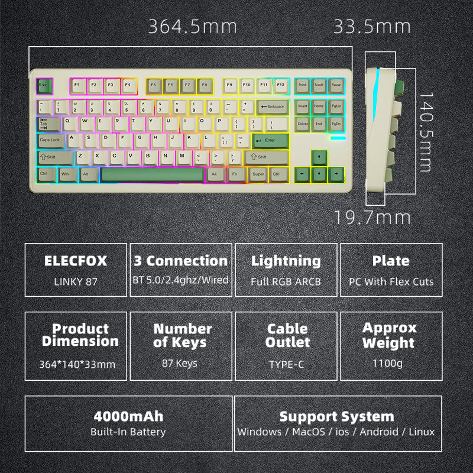
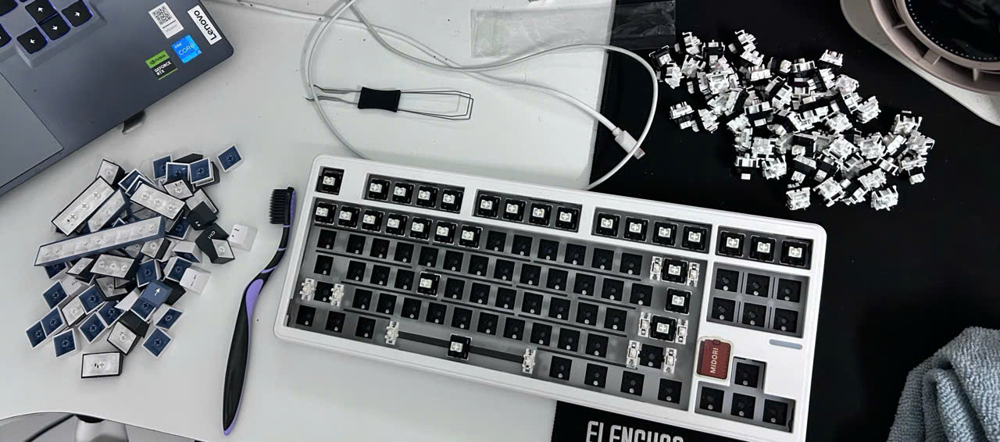

### Tổng Quan Nhỏ Gọn Nhưng Đầy Đủ "Đồ Chơi"

Gõ phím cao su laptop mỏi nhừ tay nhưng lại xót ví không dám đu trend phím cơ? Đừng lo **Linky87 (ElecFox Linky 87 / Linky 87 TKL / Pro)** mang thiết kế Tenkeyless (TKL - 87 phím) kinh điển. Đây được xem là "tỷ lệ vàng" cho những ai muốn sự gọn gàng nhưng vẫn cần đầy đủ hàng phím F (F1-F12) và cụm phím điều hướng để làm việc. 

Phím cơ dưới 1 triệu giờ không còn là “phím cho có” nữa.
Và ElecFox Linky87 là một trong số ít những con khiến mình bất ngờ khi trải nghiệm thực tế.

    *Thiết kế gọn gàng với layout 87 phím*

Nhắm đến phân khúc **dưới 1 triệu (~810.000đ - 990.000đ)**, chiếc bàn phím này được trang bị các chức năng cực kỳ đáng tiền: **Kết nối 3-mode** (Cắm dây Type-C, Bluetooth 5.0 và Wireless 2.4GHz). Bạn có thể mang nó ra quán cà phê code bài, hoặc cắm dây ở nhà để try-hard game mà không gặp bất kỳ trở ngại nào.

---

### Trải Nghiệm Thực Tế: Vượt Xa Sự Mong Đợi Ở Tầm Giá

#### 1. Cảm Giác Gõ (Typing Feel)

Đây là điểm khác biệt lớn nhất của Linky87 so với các mẫu phím giá rẻ khác.
Thay vì kiểu build "rỗng" thông thường, con này được trang bị:
- Gasket mount
- PCB & Plate có Flex-cut (PCB dày 1.2mm)
- Full foam (Rogers foam + IXPE switch pad)

=> Kết quả: cảm giác gõ mềm, có độ nhún (bounce) và không bị cứng tay khi gõ lâu.

Switch mặc định là BSUN TaiChi (Linear):
- Lực nhấn ~40±5gf (khá nhẹ)
- Hành trình ~3.6mm
- Đã được lube sẵn từ nhà máy

Trải nghiệm thực tế: gõ mượt, gần như không có cảm giác scratchy như các dòng switch stock rẻ tiền.

Ngoài ra, mạch Hotswap toàn diện cho phép bạn thay switch cực dễ mà không cần rã hàn.

---

#### 2. Hiệu Suất Chơi Game

Việc chơi game bằng Linky87 mang lại độ phản hồi rất tốt. Khi cắm dây hoặc dùng receiver 2.4G, độ trễ gần như bằng 0.

- Polling rate: 1000Hz
- Anti-Ghosting toàn phím

Những pha xử lý nhanh trong *Valorant* hay spam phím trong *Elden Ring* đều được ghi nhận chính xác.

---

#### 3. Âm Thanh (Sound Profile)

Khác với nhiều phím giá rẻ có âm rỗng (hollow), Linky87 cho âm thanh:

Thocky – trầm, đục và khá “kem” ngay từ stock

Lý do:
- Full foam
- Stabilizer plate-mount đã được lube sẵn

=> Các phím dài như Space, Enter gần như không có tiếng lạch cạch hay "ting" kim loại.

Điểm này cực hiếm ở tầm giá dưới 1 triệu.

---

#### 4. Chất Lượng Hoàn Thiện (Build Quality)

- Case nhựa ABS → nhẹ nhưng vẫn chắc chắn  
- Trọng lượng ~980g → đủ đầm, không bị xê dịch khi gõ  

Lưu ý thực tế:
- Độ dốc khá cao (mặt sau ~33.5mm)  
→ nếu gõ lâu dễ mỏi cổ tay  

Khuyên: nên dùng thêm wrist rest

---

### Ưu Điểm & Nhược Điểm 

**Ưu điểm:**
*   **P/P cực cao:** Gasket mount + full foam + VIA trong tầm giá này là rất hiếm  
*   **Âm thanh stock rất ngon:** Thocky ngay từ hộp, không cần mod  
*   **Layout TKL thực dụng**  
*   **Pin 4000mAh:** Dùng thực tế khoảng 2–3 tuần  
*   **Hỗ trợ QMK/VIA:** Custom cực sâu (remap, macro, layer)

**Nhược điểm:**
*   **Case nhựa:** Không mang lại cảm giác cao cấp như nhôm  
*   **LED RGB hơi tối:** Không rực kiểu gaming  
*   **Hotswap hơi lỏng:** Có thể kéo theo switch khi tháo keycap  
*   **Độ dốc cao:** Dễ mỏi nếu không dùng kê tay  

*Cận cảnh chi tiết Switch và Keycap của Linky87*

---

### So Sánh Nhanh: Linky87 Đứng Ở Đâu?

Nếu đặt lên bàn cân với **RK87 (Royal Kludge)**:
- RK87: build hoàn thiện nhỉnh hơn  
- Linky87:  
  => Có thể ăn đứt về trải nghiệm gõ + âm thanh + VIA + giá

So với các layout 68%:
- Nhỏ hơn nhưng thiếu F-row  
- Linky87: đa dụng hơn cho cả code và game  

---

### Chốt Hạ: Có Đáng Mua Không?

Câu trả lời là **CÓ**.

Linky87 không phải là một chiếc bàn phím hoàn hảo không tì vết. Nhưng xét trên hệ quy chiếu giá cả, những gì nó mang lại thực sự vượt kỳ vọng:

- Gõ mềm, nhún (Gasket + flex-cut)  
- Âm thocky sẵn  
- VIA custom xịn  
- 3-mode tiện lợi  
  
**Đây là một trong những con phím “ngon sẵn” hiếm hoi trong tầm giá dưới 1 triệu.**

---

**Nếu bạn đang tìm một con phím “mua về là gõ sướng ngay” mà không cần mod, thì Linky87 là lựa chọn rất khó bỏ qua ở tầm giá này.**

[Xem giá sản phẩm tại đây](https://www.elecfox.co/products/linky-87-tkl-customized-mechanical-keyboard-87-keys-wired-wireless-bluetooth-led-gaming-keyboard)