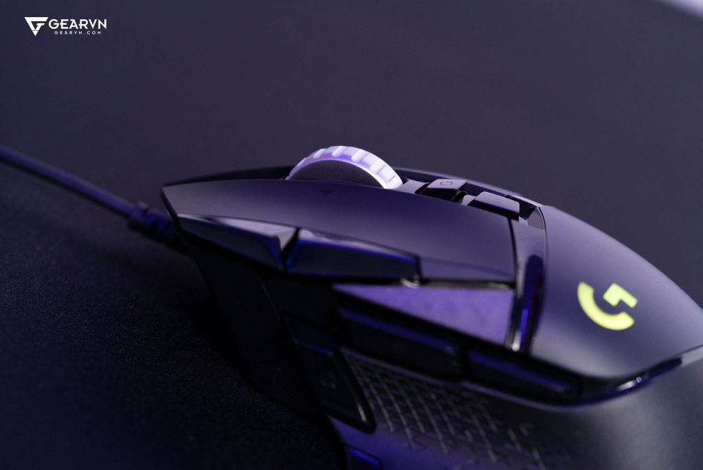

Dù thị trường chuột gaming hiện nay đang bị thống trị bởi xu hướng "siêu nhẹ" (Ultralight), **Logitech G502 Hero** vẫn duy trì một vị thế độc tôn mà khó đối thủ nào thay thế được. Là một người dùng kết hợp giữa việc viết code hàng giờ và sử dụng trong các tựa game như *Sekiro* hay *Elden Ring* hoặc cũng có thể là các game FPS, mình sẽ bóc tách tại sao con chuột này vẫn là một "vũ khí" đáng gờm ở thời điểm hiện tại.

### 1. Thông Số Kỹ Thuật Ấn Tượng

Để bắt đầu, hãy nhìn vào những con số "biết nói" tạo nên sức mạnh của dòng Hero:

| Đặc tính kỹ thuật | Chi tiết |
| :--- | :--- |
| **Cảm biến** | HERO 25K (Cảm biến quang học chính xác nhất của Logitech) |
| **Độ phân giải** | 100 – 25,600 DPI |
| **Tốc độ tối đa** | > 400 IPS |
| **Polling Rate** | 1000Hz (1ms) |
| **Trọng lượng** | 121g (Tùy biến thêm tối đa 18g với tạ rời) |

---

### 2. Thiết kế Công thái học: Khi Sự Hầm Hố Đi Cùng Công Năng

Logitech G502 Hero sở hữu thiết kế **Ergonomic** dành riêng cho người thuận tay phải. Những đường cắt cúp táo bạo không chỉ để "làm cảnh" mà được tính toán kỹ lưỡng để hỗ trợ các kiểu cầm **Palm Grip** hoặc **Claw Grip**.

*Hình 1: Hệ thống tạ rời 5 viên cho phép người dùng can thiệp trực tiếp vào trọng tâm của chuột.*

**Phân tích chuyên sâu về Trọng lượng:** Với 121g cơ bản, G502 mang lại cảm giác đầm chắc tuyệt đối. Điều này cực kỳ quan trọng đối với các pha xử lý cần độ ổn định cao trong game RPG hoặc khi bạn cần một điểm tựa chắc chắn để thao tác chính xác trên các bảng tính SQL phức tạp.

---

### 3. Hệ Sinh Thái 11 Nút Bấm & Phần Mềm G-Hub

Với các game thủ, 11 nút bấm của G502 là một "mỏ vàng" để tối ưu hóa cho trải nghiệm chơi game:

*   **Macro cho từng tựa game:** Mình thường gán các tổ hợp phím vào nút phụ của chuột để tối ưu hóa hết công năng mà không cần phải bấm gì nhiều
*   Trong các tựa game Soulslike như *Black Myth: Wukong*, việc gán các món vật phẩm hồi máu hoặc kỹ năng đặc biệt vào chuột giúp mình phản xạ nhanh hơn hẳn việc bấm phím.

*Hình 2: Khả năng tùy biến vô hạn với G-Hub giúp cá nhân hóa từng profile cho mỗi phần mềm khác nhau.*

---

### 4. Bánh Xe Cuộn Vô Cực: Tính Năng "Gây Nghiện"

Đây là tính năng khiến mình không thể rời bỏ G502 để sang các dòng chuột khác. Nút chuyển đổi chế độ cuộn (Infinite Scroll) là một cuộc cách mạng cho dân IT:
*   **Duyệt Code:** Lướt qua hàng nghìn dòng code trong **VS Code** rất mượt mà mà không khựng gì cả.
*   **Xử lý dữ liệu:** Cuộn qua các bảng Excel hay tài liệu Business Case dài dằng dặc chỉ bằng một cú gẩy nhẹ ngón tay.

---

### 5. Trải Nghiệm Thực Chiến: Gaming & Làm Việc

#### Trong Game FPS (Valorant/CS2)
Dù hơi nặng cho các pha vẩy chuột (flick shot) nhanh, nhưng G502 Hero lại cực kỳ xuất sắc trong việc kiểm soát độ giật (recoil control). Mắt đọc **HERO 25K** đảm bảo không có bất kỳ hiện tượng "pixel skipping" nào dù mình di chuyển chuột trên các bề mặt pad chuột khác nhau.

#### Trong Game Soulslike (Sekiro/Elden Ring)
Sự đầm chắc giúp mình cảm nhận được từng nhịp bấm khi thực hiện các pha **Parry** trong *Sekiro*. Đây là nơi G502 tỏa sáng thực sự nhờ sự chính xác tuyệt đối của switch cơ học dưới mỗi nút bấm.

---

### 6. Tổng Kết: Tượng Đài Có Còn Đáng Mua?

#### Ưu điểm:
*   **Cảm biến HERO 25K:** Đỉnh cao về độ chính xác và tiết kiệm năng lượng.
*   **Cuộn vô cực:** Vô đối trong các tác vụ văn phòng và coding.
*   **Độ bền:** Switch cơ học chịu được hàng chục triệu lần nhấn.

#### Nhược điểm:
*   **Dây cáp:** Dù đã được cải tiến nhưng dây bọc dù vẫn hơi cứng so với xu hướng dây Paracord hiện nay.
*   **Trọng lượng:** Có thể là rào cản với những ai thích sự thanh thoát.

**Logitech G502 Hero** không đơn thuần là một con chuột gaming; nó là một thiết bị đa năng mạnh mẽ. Nếu bạn cần một trợ thủ đắc lực có thể cùng bạn "vượt ải" đồ án vào ban ngày và "diệt Boss" Soulslike ban đêm thì đây vẫn là sự lựa chọn số 1.