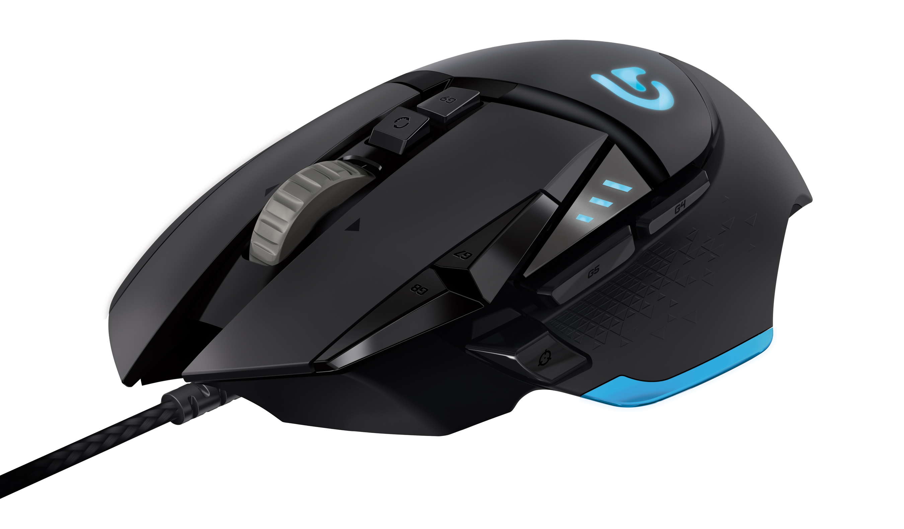
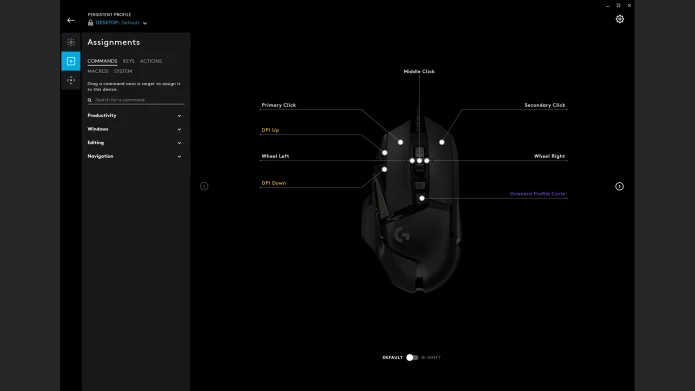

## Bạn đang dùng chuột nào — và nó có đang kìm hãm bạn không?

Có một sự thật hơi phũ: hầu hết người dùng máy tính đang dùng chuột... không phù hợp với mình.

Gamer thì dùng chuột văn phòng trơn tuột không có nút phụ. Dân IT thì dùng chuột gaming đắt tiền nhưng chỉ 2 nút bên hông, cuộn Excel 200 dòng bằng scroll wheel click-click-click từng bước như tra tấn. Và người làm việc văn phòng thì dùng chuột không dây rẻ tiền lag 3–4ms, không biết tại sao mỗi lần click thấy máy tính "chậm".

Nếu bạn rơi vào một trong ba trường hợp trên — hoặc đơn giản là đang tìm một con chuột gaming đa dụng làm được mọi thứ tốt mà không cần mua 2–3 con cho từng mục đích — thì **Logitech G502 Hero** là cái tên bạn cần đọc kỹ hôm nay.

Tớ đã dùng con này được hơn 6 tháng. Dùng cho code (IntelliJ + VS Code), cuộn Excel tài liệu hàng nghìn dòng, chơi MOBA (League), và cả FPS (Valorant). Đây là review thật — không PR, không được tài trợ.

---

## Thông Số Kỹ Thuật

| Thông số | Chi tiết |
| :--- | :--- |
| **Cảm biến** | HERO 25K (optical) |
| **DPI** | 100 – 25.600 (chỉnh từ 200 DPI) |
| **Tốc độ tối đa** | >400 IPS |
| **Gia tốc** | >40G |
| **Số nút** | 11 nút lập trình |
| **Scroll wheel** | Dual-mode: ratchet + hyper-fast free scroll |
| **Trọng lượng** | ~121g (có thể thêm tối đa ~18g) |
| **Kích thước** | 132 × 75 × 40mm |
| **Kết nối** | Có dây (bện), 2.1m, 1000Hz polling rate |
| **Đèn** | LIGHTSYNC RGB 16.8 triệu màu |
| **Bộ nhớ onboard** | 5 profiles |
| **Switch** | Omron (~50 triệu clicks) |
| **Phần mềm** | Logitech G HUB |
| **Giá tham khảo (2026)**| 850K – 1.4 triệu VND |

---

## Tổng Quan Nhanh: G502 Hero Là Gì?

G502 Hero là phiên bản nâng cấp của dòng G502 huyền thoại, thay cảm biến cũ bằng HERO 25K — một trong những cảm biến quang học tốt nhất phân khúc tầm trung đến nay.

Nếu bạn chưa biết, dòng G502 tồn tại đã hơn 10 năm và vẫn bán chạy đều — không phải vì người ta không biết có lựa chọn khác, mà vì con này thực sự làm tốt những gì nó hứa: tracking cực sạch, nhiều nút, scroll wheel độc đáo, và tùy chỉnh sâu đến mức bạn có thể mất cả buổi chiều nghịch G HUB.

Nó không phải con chuột nhẹ nhất, không phải wireless nhất, không phải đẹp nhất. Nhưng nếu bạn hỏi *"con chuột nào làm được nhiều nhất với tầm giá dưới 1.5 triệu?"* — G502 Hero rất khó bị đánh bại.

---

## Thiết Kế & Cảm Giác Cầm: Nặng Tay, Nhưng Đúng Nghĩa "Chắc Tay"

### Ergonomic thuận tay phải, không thể nhầm
G502 Hero là chuột ergonomic tay phải — có thumb rest rõ ràng, thân chuột cong vừa với bàn tay từ size M đến L. Nếu bạn thuận tay trái: xin lỗi, đây không phải chuột cho bạn.

Grip kiểu palm hoặc claw sẽ cảm thấy rất thoải mái. Grip fingertip thì hơi khó vì con này to và nặng — không phải thiết kế cho kiểu cầm đó.

*Thiết kế với thumb rest (điểm tựa ngón cái) đặc trưng*

### 121 gram — nặng hay không?
Con số 121g sẽ khiến một số người nhíu mày — nhất là dân FPS đang quen với chuột 60–80g. Nhưng với người dùng phổ thông đến gamer MOBA/MMO, 121g là mức cầm cảm giác "thật tay", không bị cảm giác chuột trôi khi thả ra.

**Bonus:** G502 đi kèm 5 weights 3.6g có thể lắp vào hoặc tháo ra để điều chỉnh cân bằng trọng lượng. Muốn nặng hơn cho gaming ổn định? Lắp hết. Muốn nhẹ hơn cho công việc? Tháo bớt. Tính năng này nghe "tiểu tiết" nhưng thực tế rất hữu dụng khi bạn đã quen chỉnh.

### Chất lượng build
Nhựa cứng, không ọp ẹp, không có cảm giác kẽ hở hay rung lắc. Sau 6 tháng dùng hằng ngày, bề mặt nhám chống trơn vẫn ok, không bị bóng hay mòn rõ. Switch Omron 50 triệu clicks — với mức dùng bình thường, bạn sẽ không cần lo chuyện hỏng nút trong vài năm tới.

---

## Scroll Wheel: Tính Năng Bị Đánh Giá Thấp Nhất Trên Con Chuột Này

Thẳng thắn mà nói: scroll wheel của G502 Hero là thứ tớ thích nhất trên con chuột này — và không nhiều người nói về nó đủ nhiều.

*Nút bấm vật lý chuyển đổi 2 chế độ cuộn siêu mượt*

**Dual-mode scroll wheel**
Bạn có thể chuyển đổi giữa hai chế độ bằng một nút bấm nhỏ phía dưới scroll wheel:
*   **Ratchet mode (click từng bước):** Cảm giác click rõ ràng khi cuộn — chuẩn để chơi game (đổi vũ khí, chọn kỹ năng), đọc tài liệu theo từng đoạn, không bị cuộn quá.
*   **Hyper-fast free scroll (cuộn tự do):** Nhấn nút chuyển — scroll wheel quay trơn không có điểm dừng. Cuộn 1000 dòng Excel trong 2 giây. Cuộn một file PDF 80 trang không cần nhấc tay. Đây là lần đầu tiên tớ thấy việc cuộn tài liệu... thú vị.

Ngoài ra còn có scroll nghiêng trái/phải — cuộn ngang bảng tính, timeline video editor, hoặc map trong một số game. Nhỏ nhưng dùng quen thì không thiếu được.

---

## Hiệu Năng Thực Tế: Gaming và Làm Việc

### Gaming

*   **MOBA (League of Legends, Dota 2):** G502 Hero gần như được sinh ra cho MOBA. 11 nút lập trình cho phép bạn gán active item, trinket, summoner spell hoặc bất kỳ phím tắt nào vào ngón cái. Tớ gán 3 nút bên hông cho ward, trinket swap và recall — giảm hẳn phụ thuộc vào bàn phím trong những teamfight căng.
*   **FPS (Valorant, CS2):** Đây là nơi G502 Hero bắt đầu lộ điểm yếu. Tracking HERO 25K cực sạch — zero smoothing, zero filtering, zero acceleration. Aim không bị "kéo" hay "trôi" ở bất kỳ DPI nào. Nhưng 121g là mức nặng đáng kể nếu bạn chơi competitive FPS theo kiểu flick shot liên tục. Tớ chơi được bình thường, nhưng không thể nói nó là chuột FPS tối ưu. 
*   **MMO/RPG:** Đây là sân nhà. 11 nút có thể lập trình macro phức tạp qua G HUB — ideal cho game nhiều kỹ năng, nhiều phím tắt.

### Lập trình / Dev
Sau vài tháng, đây là use case tớ dùng nhiều nhất. Cụ thể:
*   **Nút sniper (giảm DPI tạm thời):** Rất hữu ích khi cần click chính xác vào element nhỏ trong IDE, chỉnh pixel trong Figma, hay chọn text chính xác. Giữ nút, DPI giảm đột ngột → di chuột chậm hơn, click chuẩn hơn.
*   **Hyper-fast scroll:** Cuộn file code dài 500+ dòng nhanh không tưởng. Tìm function ở đầu file trong khi đang ở cuối — 1 giây, không cần Ctrl+Home.
*   **Bộ nhớ onboard 5 profiles:** Tớ có profile riêng cho code (DPI thấp + macro IDE), profile game (DPI cao), profile Excel (scroll wheel tự do). Cắm vào máy tính nào cũng dùng được ngay, không cần cài G HUB.

### Làm việc văn phòng / Excel
Ai thường xuyên làm việc với Excel hoặc Google Sheets sẽ hiểu ngay khi thử hyper-fast scroll lần đầu. Cuộn qua 5000 dòng data trong 3 giây. Scroll ngang bảng tính 50 cột không cần kéo thanh scroll. Đây là QoL upgrade thật sự.

---

## Tính Năng Nổi Bật

### Cảm biến HERO 25K — Tracking chuẩn không cần lo
HERO 25K là cảm biến không có smoothing, không có filtering, không có acceleration phần mềm. Ở mức DPI bình thường (800–1600 DPI), tracking tuyệt đối ổn định — không jitter, không drift.

### 11 nút lập trình — Nhiều hơn bạn nghĩ
11 nút nghe có vẻ "nhiều quá cần gì đến vậy", nhưng khi bạn đã gán đủ shortcut thì sẽ lười về lại dùng chuột ít nút hơn. Tiêu biểu:
*   Nút Forward/Back trình duyệt (ai cũng dùng)
*   Nút sniper giảm DPI (dân design/code sẽ thích)
*   Nút đổi DPI profile nhanh
*   3 nút bên hông tùy chỉnh tự do

### Logitech G HUB — Mạnh nhưng hơi nặng
G HUB cho phép tùy chỉnh DPI theo từng game, tạo macro, gán nút, chỉnh RGB, và lưu theo từng application profile. 
**Điểm trừ nhỏ:** G HUB tốn RAM hơn cần thiết và đôi khi chậm load. Nhưng vì có bộ nhớ onboard 5 profiles, bạn không cần mở G HUB mỗi lần dùng — chỉ cần cài một lần, lưu profile xong thì tắt đi.

*Giao diện tùy chỉnh Macro và DPI trên G HUB*

---

## Ưu & Nhược Điểm

**Ưu điểm**
*   Tracking HERO 25K chuẩn xác — tracking sạch nhất tầm giá.
*   Scroll wheel dual-mode độc đáo — không đối thủ nào ở tầm giá này có.
*   11 nút + sniper button — tùy chỉnh sâu, phù hợp mọi use case.
*   Bộ nhớ onboard 5 profiles — dùng ở bất kỳ máy tính nào, không cần phần mềm.
*   Build chắc chắn, switch Omron bền — dùng được nhiều năm.
*   Weights tùy chỉnh — chỉnh cân bằng theo sở thích.
*   Giá tốt so với tính năng — dưới 1.5 triệu cho một con chuột full-featured.

**Nhược điểm**
*   Nặng (~121g) — không lý tưởng cho FPS competitive style flick shot liên tục.
*   Có dây — dây bện giảm ma sát nhưng vẫn là dây. (Nếu cần wireless thì xem bản G502 X Lightspeed).
*   Nâng cấp khó bàn bên trong — không tháo lắp switch như một số chuột modular.
*   G HUB hơi nặng — nhưng không bắt buộc dùng thường xuyên.
*   Chỉ cho tay phải — lefties: not for you.

---

## Ai Nên Mua — Ai Không Nên Mua

**NÊN MUA nếu bạn là:**
*   **Sinh viên IT / Developer:** Đây gần như là chuột được tạo ra cho bạn. Scroll wheel hyper-fast, nút sniper cho click chính xác, profile onboard — tất cả đều giải quyết pain point thực tế khi code hàng giờ mỗi ngày.
*   **Gamer đa thể loại (MOBA, MMO, RTS):** 11 nút lập trình + tracking HERO 25K là bộ đôi hoàn hảo cho game cần nhiều phím tắt.
*   **Người dùng đa dụng (office + game):** Cần một con chuột duy nhất cho cả công việc lẫn giải trí mà không muốn compromise.

**KHÔNG NÊN MUA nếu bạn:**
*   **Chơi FPS competitive thuần, cần chuột thật nhẹ:** Nếu Valorant hoặc CS2 là cuộc sống và bạn flick liên tục — 121g sẽ là một vấn đề. 
*   **Cần wireless bằng mọi giá:** G502 Hero chỉ có dây. Nếu wireless là deal breaker, hãy xem bản G502 X Lightspeed.
*   **Thuận tay trái:** Không có phiên bản tay trái. 

---

## So Sánh Nhẹ Với Chuột FPS / Nhẹ Cân: Khi Nào Nên Đổi Hướng?

| Tính năng | G502 Hero | Logitech G Pro X Superlight 2 | Razer Viper V3 HyperSpeed |
| :--- | :--- | :--- | :--- |
| **Trọng lượng** | ~121g | ~60g | ~82g |
| **Cảm biến** | HERO 25K | HERO 2 25K | Focus Pro 30K |
| **Số nút** | 11 | 5 | 5 |
| **Kết nối** | Có dây | Wireless | Wireless |
| **Giá (~2026)** | 850K – 1.4tr | ~3 – 4 triệu | ~1.5 – 2 triệu |
| **Tối ưu cho** | Đa dụng, MOBA, code | FPS competitive | FPS / Đa dụng nhẹ |

**Kết luận từ bảng so sánh:** G502 Hero không cạnh tranh với chuột FPS nhẹ — nó không được thiết kế cho việc đó. Nếu bạn muốn tối ưu cho FPS và sẵn sàng bỏ 2–4 triệu, các dòng nhẹ hơn như G Pro X Superlight hay Viper V3 là hướng đi khác. Nhưng nếu bạn cần đa năng, đa dụng, giá hợp lý — G502 Hero không có đối thủ xứng tầm ở mức giá dưới 1.5 triệu.

---

## Kết Luận: Có Đáng Xuống Tiền Không?

**Đáng. Rõ ràng đáng.**

Sau 6 tháng, tớ không có lý do gì để đổi chuột — và đó là thứ thuyết phục nhất có thể nói về một sản phẩm. G502 Hero không hoàn hảo: nó nặng, nó có dây, G HUB hơi nặng. Nhưng những điểm đó không ảnh hưởng đến trải nghiệm hàng ngày của tớ đủ để cảm thấy đáng đổi.

Scroll wheel hyper-fast thay đổi cách tớ làm việc với tài liệu. Nút sniper là thứ tớ không ngờ mình sẽ dùng nhiều đến vậy. 11 nút lập trình biến chuột từ "thiết bị input" thành "công cụ năng suất".

Nếu bạn đang tìm một con chuột gaming đa dụng làm tốt cả gaming lẫn công việc, không muốn mua 2 con cho 2 mục đích, và ngân sách trong tầm 1–1.5 triệu — đây là lựa chọn đáng xuống tiền nhất.

---

## Nên Mua Bản Nào? Mua Ở Đâu?

*   **G502 Hero (có dây):** Lựa chọn tớ đang dùng và review trong bài này. Giá tốt, tracking chuẩn, đủ dùng cho 99% người.
*   **G502 X Lightspeed (wireless):** Nếu dây là vấn đề với bạn, bản này giải quyết nhưng giá cao hơn đáng kể (~2.5–3.5 triệu). 

**Về giá:** G502 Hero đang dao động 850K – 1.4 triệu tùy shop (CellphoneS, An Phát, GearVN). Các đợt sale lớn có thể xuống dưới 900K.

**MUA NGAY CHÍNH HÃNG TẠI ĐÂY (TRÁNH HÀNG FAKE):**
*   [Xem giá Logitech G502 Hero tại GearVN](https://gearvn.com/products/logitech-g502-hero)
*   [Xem giá Logitech G502 Hero tại An Phát PC](https://www.anphatpc.com.vn/chuot-logitech-g502-hero.html)

---

*** 
*Review dựa trên 6 tháng sử dụng thực tế. Không có mối quan hệ tài trợ với Logitech hoặc bất kỳ nhà phân phối nào. Giá tham khảo tháng 5/2026, có thể thay đổi theo thời điểm và khuyến mãi.*