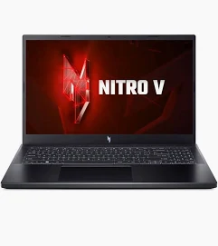
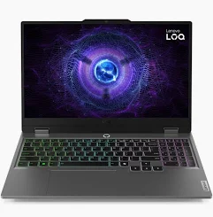
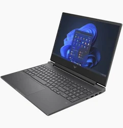
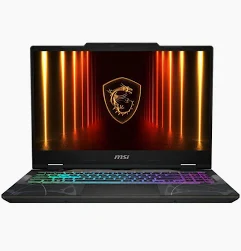
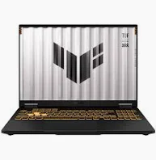

### Tổng Quan: Bỏ 20 triệu mà mua nhầm thì xót lắm!

Tầm giá 20 triệu là một trong những phân khúc "đau đầu" nhất khi chọn laptop gaming. Không ít, không nhiều — đủ để mua được máy ngon, nhưng cũng đủ để... mua nhầm rồi tiếc ngơ tiếc ngẩn.

Nếu bạn là sinh viên IT cần máy vừa code vừa xả stress bằng vài ván game, hoặc là game thủ ngân sách thấp muốn chạy AAA title mà không muốn bán thận — thì bài này viết đúng cho bạn.

Tôi đã ngồi quét qua Cellphones, FPT Shop, Phong Vũ, GearVN, ThinkPro... để tổng hợp **5 chiếc laptop gaming 20 triệu đáng tiền nhất** đang bán tại Việt Nam tính đến lúc này. Ưu tiên model mới, có GPU rời từ RTX 3050 trở lên, phù hợp cả gaming lẫn lập trình. 

Không PR, không tô hồng. Let's go.

---

### 1. Acer Nitro V 15 — "Quốc dân" không cần giải thích

**Giá tham khảo:** 19–22 triệu | **Cấu hình:** Ryzen 5 6600H · RTX 3050/4050 6GB · 16GB RAM · 512GB SSD | **Màn hình:** 15.6" FHD IPS 165Hz

*Thiết kế của Acer Nitro V 15*

**Tại sao nó lại bán chạy đến vậy?**
Bởi vì Nitro V làm được thứ khó nhất: **cho bạn nhiều nhất với số tiền bỏ ra ít nhất**. Valorant, LoL, CS2 chạy max setting thoải mái. Những tựa AAA như Cyberpunk hay Elden Ring thì medium–high, ổn định quanh 60fps — không mượt như mơ nhưng chơi được, không lag khó chịu.

Tản nhiệt của máy khá ổn cho phân khúc này. Quan trọng hơn: **RAM và SSD đều nâng cấp được dễ dàng**, không cần tua vít mấy chục con vít hay đọc cả trang guide phức tạp.

**Ưu Điểm & Nhược Điểm**
*   **Ưu điểm:** Value/tiền tốt nhất phân khúc. Màn hình 165Hz mượt mà. Dễ nâng cấp RAM lên 32GB về sau.
*   **Nhược điểm:** Build toàn nhựa, cầm không có cảm giác "premium". Nặng ~2.1kg. Loa chỉ ở mức chống điếc.

**Không cần nghĩ nhiều nếu mục tiêu chính là gaming và ngân sách tối ưu.** Bộ ba hoàn hảo: Máy ngon, giá tốt, nâng cấp dễ.

---

### 2. Lenovo LOQ 15 — Dành cho người muốn dùng lâu dài

**Giá tham khảo:** 19–22 triệu | **Cấu hình:** i5-12450HX hoặc Ryzen 5 · RTX 3050 6GB · 16GB RAM · 512GB SSD | **Màn hình:** 15.6" FHD 144Hz

*Lenovo LOQ 15 với thiết kế mang hơi hướng Legion*

**Đứa em của Legion, nhưng không kém cạnh**
LOQ là dòng gaming tầm trung của Lenovo. Build chắc chắn hơn hẳn Nitro V. Bàn phím gõ tốt, có backlight, đủ chuẩn để code 5–6 tiếng một ngày không mỏi tay.

**Lenovo Vantage** là điểm cộng lớn cho dân IT: toggle power mode, quản lý tản nhiệt tiện tay. Hiệu năng đa nhiệm khi mở IDE + trình duyệt 15 tab + Discord cùng lúc rất mượt. Đặc biệt hệ thống tản nhiệt hoạt động cực kỳ ổn định.

**Ưu Điểm & Nhược Điểm**
*   **Ưu điểm:** Build chắc chắn, cảm giác bền bỉ lâu dài. Bàn phím gõ dễ chịu. Tản nhiệt ổn định.
*   **Nhược điểm:** Màn hình 144Hz không quá rực rỡ. Quạt đôi khi khá to trong môi trường yên tĩnh.

**Lựa chọn tốt nhất cho sinh viên IT hoặc dev cần máy dùng 3–4 năm.** Code là chính, game là phụ, cần sự chắc chắn — LOQ là chân ái.

---

### 3. HP Victus 15/16 — Lựa chọn "an toàn" cho tất cả mọi người

**Giá tham khảo:** 19–22 triệu | **Cấu hình:** i5-13420H hoặc Ryzen 5-7 · RTX 3050 6GB · 16GB RAM · 512GB SSD | **Màn hình:** 15.6" FHD 144Hz

*HP Victus phù hợp mang đi học và văn phòng*

**Đẹp, gọn, đủ dùng — không drama**
HP Victus là chiếc laptop gaming hiếm hoi trông không quá "gamer". Mang vào văn phòng hay trường học không ai nhìn ngó, mà mở game lên thì vẫn chiến tốt. 

Hiệu năng cân bằng giữa gaming và công việc. Đặc biệt, âm thanh loa tốt hơn hẳn Nitro V — nếu bạn hay nghe nhạc hoặc xem phim không dùng tai nghe, đây là điểm cộng đáng kể.

**Ưu Điểm & Nhược Điểm**
*   **Ưu điểm:** Thiết kế sạch sẽ, không phô trương. Âm thanh loa khá ngon. Hiệu năng đa dụng cân bằng.
*   **Nhược điểm:** Build nhựa. Tháo lắp để nâng cấp RAM/SSD khó nhằn hơn các hãng khác.

**Phù hợp cho dân văn phòng kiêm gamer hoặc sinh viên cần máy đa dụng**, trông bình thường và không muốn cắm tai nghe suốt ngày.

---

### 4. MSI Cyborg 15 — Mỏng nhẹ nhất, style nhất

**Giá tham khảo:** 19–23 triệu | **Cấu hình:** i5-12450H/i7 · RTX 3050/4050 · 16GB RAM · 512GB SSD | **Màn hình:** 15.6" FHD 144Hz

*MSI Cyborg 15 với phong cách Cyberpunk mỏng nhẹ*

**Laptop gaming mà trông như ultrabook gamer**
Cyborg nặng chỉ khoảng **1.8kg** — nhẹ nhất trong cả danh sách. Thiết kế "cyber" với các chi tiết nhựa trong suốt cực kỳ hút mắt. Màn hình hiển thị tốt, bản RTX 4050 chạy mượt mà.

**Nhưng cần nói thẳng:** vì mỏng nhẹ nên tản nhiệt là điểm yếu rõ nhất. Khi chơi game nặng 1–2 tiếng, máy nóng đáng kể và quạt chạy khá to. Build mỏng cũng đồng nghĩa độ bền cơ học không bằng TUF hay LOQ.

**Ưu Điểm & Nhược Điểm**
*   **Ưu điểm:** Siêu nhẹ (~1.8kg) tiện mang vác. Thiết kế độc đáo. Màn hình hiển thị tốt.
*   **Nhược điểm:** Tản nhiệt dễ bị nóng. Build mỏng nên kém chắc chắn về mặt cơ học.

**Dành cho người hay di chuyển, thích style "cyber" và không cày game quá 2 tiếng/ngày.** Đừng mua nếu bạn có thói quen gaming marathon.

---

### 5. ASUS TUF Gaming A15/F15 — Cứng như đá, bền như trâu

**Giá tham khảo:** 19–22 triệu | **Cấu hình:** Ryzen 5-7 hoặc i5 · RTX 3050 · 16GB RAM · 512GB SSD | **Màn hình:** 15.6" FHD 144Hz

*ASUS TUF Gaming hầm hố và trâu bò*

**Cái tên nói lên tất cả: TUF = Tough**
Đạt chuẩn quân sự **MIL-STD-810H**, điều này đồng nghĩa: **máy này rất khó hỏng vặt**. Bàn phím gõ chắc tay, không có cảm giác bập bênh. Hiệu năng gaming ổn định theo thời gian, không bị giảm hiệu suất đột ngột.

Điểm yếu thật lòng: Thiết kế trông khá "đứng tuổi", máy nặng, và tản nhiệt chỉ ở mức trung bình.

**Ưu Điểm & Nhược Điểm**
*   **Ưu điểm:** Chuẩn độ bền quân sự MIL-STD-810H. Bàn phím chắc chắn. Hiệu năng duy trì ổn định qua nhiều năm.
*   **Nhược điểm:** Thiết kế hơi nặng nề và thô. Tản nhiệt chưa thực sự ấn tượng.

**Mua một lần dùng 4–5 năm không lo.** Nếu bạn cần một cái máy quăng quật thoải mái, ít hỏng vặt, TUF là câu trả lời.

---

### Chốt Luận: Nên Xuống Tiền Chốt Em Nào?

Không có "máy tốt nhất" tuyệt đối — chỉ có máy phù hợp nhất. Đây là tóm tắt nhanh cho anh em:

*   **Game thuần, ưu tiên giá:** => **Acer Nitro V 15** 
*   **Code IT + Game, cần bền:** => **Lenovo LOQ 15**
*   **Đa dụng, thiết kế văn phòng:** => **HP Victus**
*   **Hay mang lên trường, thích ngầu:** => **MSI Cyborg** 
*   **Nồi đồng cối đá 5 năm:** => **ASUS TUF**

**Lời khuyên của mình:** Dù chọn máy nào, hãy ưu tiên bản có RTX 3050 6GB + 16GB RAM. Nếu sau này chạy Docker hay IDE nặng, việc nâng cấp lên 32GB RAM là khoản đầu tư đáng tiền nhất bạn có thể làm. 

Anh em đang phân vân model nào hay có ngân sách cụ thể hơn không?